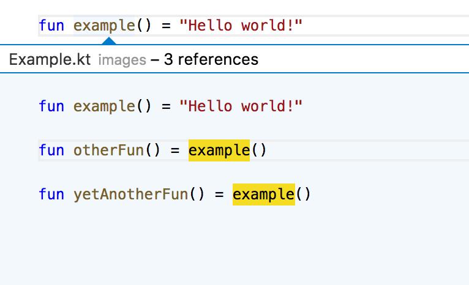
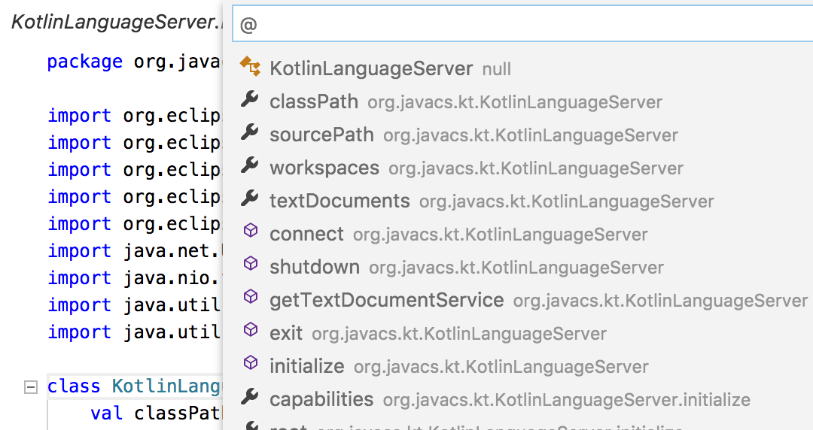
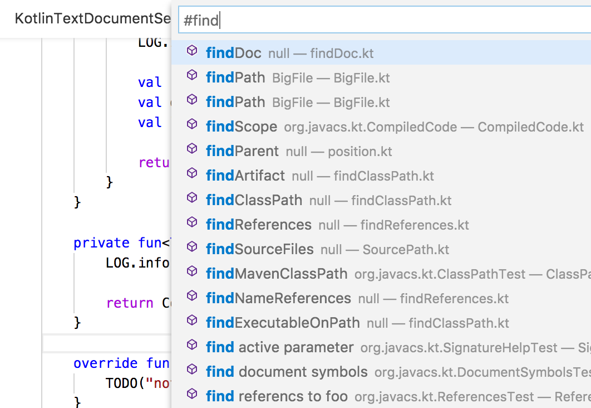

# This repository needs your help

I created this project while I was considering using Kotlin in my work. I ended up deciding not to and I'm not really using Kotlin these days, but this is a pretty fully-functional language server that just needs someone to use it every day for a while and iron out the last few pesky bugs.

This project implements a [language server](https://microsoft.github.io/language-server-protocol/) using the internal APIs of the [Kotlin compiler](https://github.com/JetBrains/kotlin/tree/master/compiler). There are two hard parts of implementing a language server:
- Figuring out the dependencies
- Incrementally re-compiling as the user types

Dependencies are determined by the [findClassPath](https://github.com/georgewfraser/kotlin-language-server/blob/master/src/main/kotlin/org/javacs/kt/classpath/findClassPath.kt) function, which invokes Maven and tells it to output a list of dependencies in a temporary folder. Currently, Maven is the only supported build tool.

I get incremental compilation at the file-level by keeping the same `KotlinCoreEnvironment` alive between compilations in [Compiler.kt](https://github.com/georgewfraser/kotlin-language-server/blob/master/src/main/kotlin/org/javacs/kt/Compiler.kt). There is a performance benchmark in [OneFilePerformance.java](https://github.com/georgewfraser/kotlin-language-server/blob/master/src/test/java/org/javacs/kt/OneFilePerformance.java) that verifies this works.

Getting incremental compilation at the expression level is a bit more complicated:
- Fully compile a file and store in [CompiledFile](https://github.com/georgewfraser/kotlin-language-server/blob/master/src/main/kotlin/org/javacs/kt/CompiledFile.kt):
    - `val content: String` A snapshot of the source code 
    - `val parse: KtFil` The parsed AST 
    - `val compile: BindingContext` Additional information about the AST from typechecking 
- After the user edits the file:
    - Find the smallest section the encompasses all the user changes
    - Get the `LexicalScope` encompassing this region from the `BindingContext` that was generated by the full-compile
    - Create a fake, in-memory .kt file with just the expression we want to re-compile
        - [Add space](https://github.com/georgewfraser/kotlin-language-server/blob/master/src/main/kotlin/org/javacs/kt/CompiledFile.kt#L81) at the top of the file so the line numbers match up
    - Re-compile this tiny fake file

The incremental expression compilation logic is all in [CompiledFile.kt](https://github.com/georgewfraser/kotlin-language-server/blob/master/src/main/kotlin/org/javacs/kt/CompiledFile.kt). The Kotlin AST has a built-in repair API, which seems to be how IntelliJ works, but as far as I can tell this API does not work if the surrounding IntelliJ machinery is not present. Hence I created the "fake tiny file" incremental-compilation mechanism, which seems to be quite fast and predictable.

There is an extensive suite of behavioral [tests](https://github.com/georgewfraser/kotlin-language-server/tree/master/src/test/kotlin/org/javacs/kt), which are all implemented in terms of the language server protocol, so you should be able to refactor the code any way you like and the tests should still work.

## Features

### Autocomplete

### Signature help

### Hover

### Go-to-definition, find all references

### Document symbols

### Global symbols

## Requirements

## Known Issues